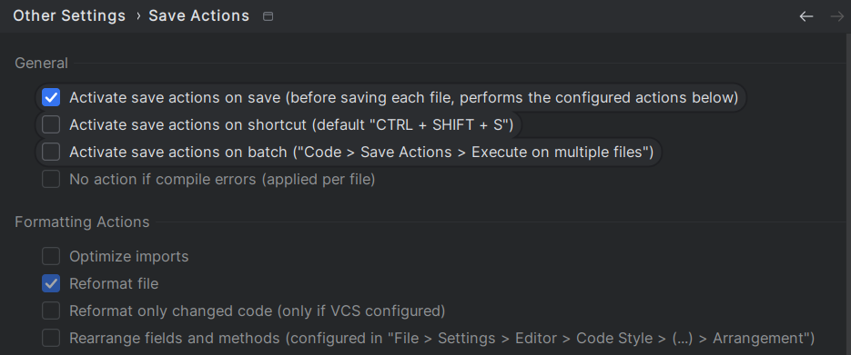

# Contributing Guidelines

Thank you for considering to contribute to our project.
We greatly appreciate both feedback and code contributions from everyone. Be aware that by
participating you are expected to agree to our [Code of Conduct](./CODE_OF_CONDUCT.md).
There are several ways you can contribute to our project as outlined in the sections below.

## Reporting a bug or suggesting a feature

You can report a bug or suggest enhancements by creating an issue on this github repository.
Please make sure to check whether another issue with the same bug/feature has already been created.

## Contribute code

If you would like to contribute code to this repository, you can do so by following these steps:

1. Create an issue that describes the bug/enhancement related to your code changes
    - please check whether an issue already exists that describes your bug/enhancement
    - please also mention in the created issue that you intend to work on it
2. Fork the repository and make the intended changes
    - makes sure that your code, branch names and commit messages adhere to the guidelines defined
      below
3. Once your implementation is done and has been tested by yourself, create a pull request that...
    - ...is linked to the relevant issue
    - ...adheres to our pull request guidelines as defined below
4. We will then look at your changes and begin testing them
5. Afterward, if everything is fine, the changes are merged into our repository

## Commit and Branch Guidelines

When creating commits, please keep the following in mind:

- A commit message should not only summarize what has been changed, but should also explain why
- A commit message should be written in english and in present tense
- A commit message should begin with the following format: `#<issue id> - <commit message>`
    - where `<issue id>` references the issue associated with the bug/enhancement that you intend to
      make

When creating branches, please keep the following in mind:

- A branch name should adhere to the following format: `<branch type>/<issue id>-<branch name>`
    - where `<branch type>` is either `feature`, `fix`, or `tmp`
    - where `<issue id>` references the issue associated with the bug/enhancement that you intend to
      make
    - where `<branch name>` is lowercase and separated by `-` instead of spaces

## Git Workflow

For this repository we have agreed on the following git workflow:

- The `main` branch is the default branch and should always be in a working state
- Aside from the `main` branch, there can be many `feature`/`fix` branches
- Once a feature or a fix has been completed and tested, it can be merged into `main` via a PR
    - Use a merge commit, no fast forward merges!
    - Preferably rebase your branch onto `main` before completing the PR
- Once the `main` branch reaches a stable state, we can create a release by...
    - creating an annotated tag `vX.Y.Z` for the target commit on the `main` branch
        - tag message should be: `Release vX.Y.Z`
    - creating a release on github that references the tag
    - attaching the release binaries to the github release

## Code Formatting

We use [Prettier](https://prettier.io/) for TypeScript code formatting.
To ensure that the code formatting follows our configuration
in [.prettierrc](https://github.com/EXXETA/rufus/blob/main/.prettierrc), the Prettier plugin should
be installed in your IDE.
The setup for Prettier is described in the following sections for IntelliJ and Visual Studio Code:

### IntelliJ

1. Navigate to **Settings** > **Plugins**.
2. Install [Prettier](https://plugins.jetbrains.com/plugin/10456-prettier) from marketplace.
3. Install [Save Actions X](https://plugins.jetbrains.com/plugin/22113-save-actions-x) from
   marketplace.
4. Activate options "Activate save actions on save (before saving each file, performs the configured
   actions below)" and "Reformat file":
   

### Visual Studio Code

Install [Prettier - Code formatter](https://marketplace.visualstudio.com/items?itemName=esbenp.prettier-vscode)
from Extensions. When installation is completed, Prettier will be used directly as the default
formatter when saving a file, as it is already configured in `.vscode/settings.json`.

---
After following these instructions, the code should always be formatted automatically when saving a
file.

However, you can check all Typescript files for code style issues with this command:
`npx prettier '**/*.{ts,tsx}' --check`

If you want Prettier to fix code style issues, you can use the following command:
`npx prettier '**/*.{ts,tsx}' --write`
