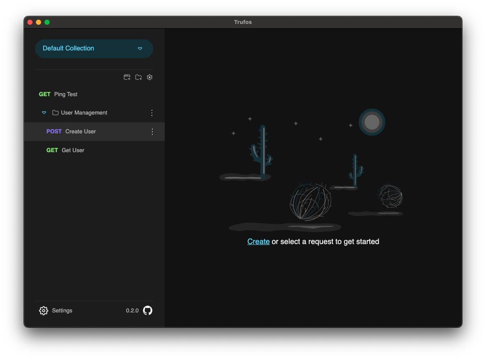
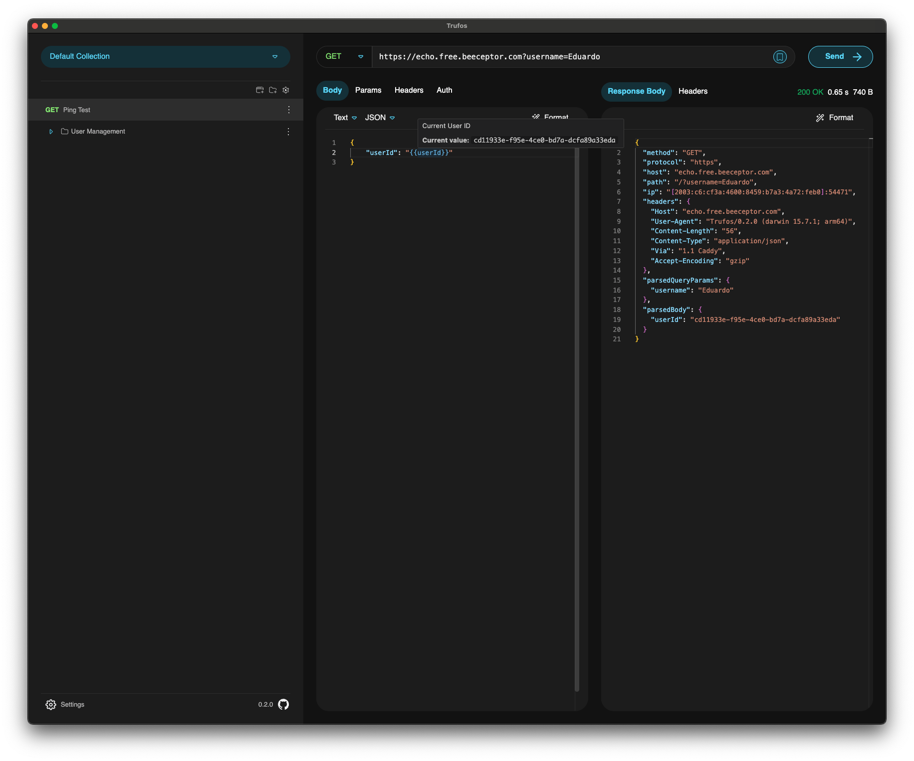

<h1 align="center">Trufos - The REST Utility, free and Open Source</h1>

  A REST client that is both easy to use, efficient, and extendable.

As many REST clients exist in the ecosystem, Trufos aims to provide an out-of-the-box experience
that is fast, user-friendly, and customizable. Below is an overview of current and planned features:

| Feature                                       | Status         | Notes                                                    |
| --------------------------------------------- | -------------- | -------------------------------------------------------- |
| Project maturity                              | 🚧 Early Stage | Active development; APIs & data shapes may evolve        |
| Offline usage (no registration / login)       | ✅ Implemented | Works fully offline; all data stored locally             |
| Cross-platform (Win / macOS / Linux)          | ✅ Implemented | Electron-based distribution with native packaging        |
| Handling of large request & response payloads | ✅ Implemented | Streamed & chunked processing keeps UI responsive        |
| Version control-friendly collections          | ✅ Implemented | Collections stored as JSON for easy diff & collaboration |
| Third party collection import                 | 🚧 Partially   | Currently supports Postman                               |
| Environment & variable management             | ✅ Implemented | Named environments with scoped variables                 |
| Authentication (JWT, OAuth 2.0, Basic)        | ✅ Implemented | Strategy factory incl. OAuth2 client credentials         |
| Scripting (custom request/response handling)  | 🛠 Planned     | Script engine & sandbox design in progress               |
| Plugin architecture / extensions              | 🛠 Planned     | Extensible API for third-party integrations              |

If you would like to contribute to this project, please check out our [Contributing Guidelines](./CONTRIBUTING.md).

## Installation

Grab the latest release from the [GitHub Releases](https://github.com/EXXETA/trufos/releases) page and install it for your platform:

- Windows: Download the `Setup.exe` installer
- macOS: Download the `.dmg` image
- Linux: Download the `.zip` archive (native `.deb` packaging planned)

No account or telemetry is required—Trufos runs locally and keeps your data on your machine.

## Requirements

As Trufos is an Electron application, it can run on Windows, macOS, and Linux without any issues. If
you want to develop or build this software yourself, you will need Node.js version 24. We use **yarn**
and not NPM in this project as it can better handle peer dependencies. **Do not install dependencies with NPM!**

### Local Development

1. Clone this repository
2. Run `yarn install` to install all dependencies
3. Run `yarn start` to start the application in development mode

### Building the Application

1. Run `yarn install` to install all dependencies
2. Run `yarn run make` to build the application for your platform
3. The built application will be in the `out/make` directory
   - Windows: a `Setup.exe` file
   - macOS: a `.dmg` file
   - Linux: currently a ZIP file (`.deb` file is planned)

## Usage

Once Trufos is installed and launched, you can start adding endpoints, customizing them, and making
calls.

### Example Usage

Here’s a simple example of how to add and utilize an endpoint:

1. Click on "Create New Request".
2. Enter the URL.
3. Select the method (`GET`, `POST`, etc.).
4. Optionally, add headers and body content.
5. Click "Send Request" and review the response in the results area.

### Importing Collections

You can import existing Postman collections to migrate quickly:

1. Open the collection import view.
2. Select the Postman collection file or directory.
3. Confirm import; Trufos will convert and persist it under a folder named after the collection title.

Collections are saved in a version-control-friendly JSON structure so you can diff and review changes.

### Environments & Variables

Define multiple environments (e.g., `dev`, `staging`, `prod`) each with its own variables. Selecting an environment scopes variable resolution for requests. Variables and environments are also stored as JSON ensuring easy collaboration.

### Large Payload Streaming

Trufos uses IPC push streams to process large request/response bodies incrementally. This avoids blocking the UI and keeps memory usage lower when dealing with multi-megabyte payloads.

### Development Commands

| Command               | Description                                       |
| --------------------- | ------------------------------------------------- |
| `yarn start`          | Run the app in development mode (Electron + Vite) |
| `yarn make`           | Package distributables for the current OS         |
| `yarn test`           | Execute Vitest test suite                         |
| `yarn lint`           | Run ESLint over TypeScript & React sources        |
| `yarn prettier`       | Format code (TS/TSX) with Prettier                |
| `yarn prettier-check` | Check formatting without writing changes          |

### Roadmap (High-Level)

| Item                                      | Status  | Notes                                            |
| ----------------------------------------- | ------- | ------------------------------------------------ |
| Scripting engine (request/response hooks) | Planned | Execution sandbox & dependency management design |
| Plugin architecture                       | Planned | Public extension API & lifecycle hooks           |
| More auth strategies (Hawk, NTLM, etc.)   | Planned | Evaluating demand & libraries                    |
| Linux native packaging (`.deb`)           | Planned | Electron Forge configuration WIP                 |
| Improved collection diff tooling          | Planned | Visual diff & merge assistance                   |
| Performance profiling view                | Planned | Inspect timing & size insights                   |
| Accessibility enhancements                | Planned | WCAG compliance audit scheduled                  |

## FAQ

- Where can I find the saved Requests?
- The saved requests are in this folder:
  - Mac: `~/Library/Application\ Support/Trufos/default-collection`
  - Windows: `%AppData%\Trufos\default-collection`

- Where can I find the logs?
- The logs are in this folder:
  - Mac: `~/Library/Logs/Trufos`
  - Windows: `%AppData%\Trufos\logs`

## Contributing

If you would like to contribute to this project, please check out our
[Contributing Guidelines](./CONTRIBUTING.md) and [Code of Conduct](./CODE_OF_CONDUCT.md) before you
begin.

We welcome feedback, suggestions, and pull requests!

## Licence

Licensed under GPL v3.0.
