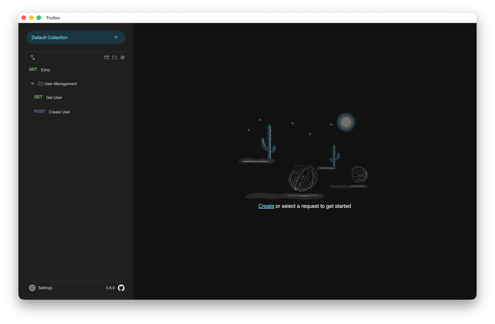
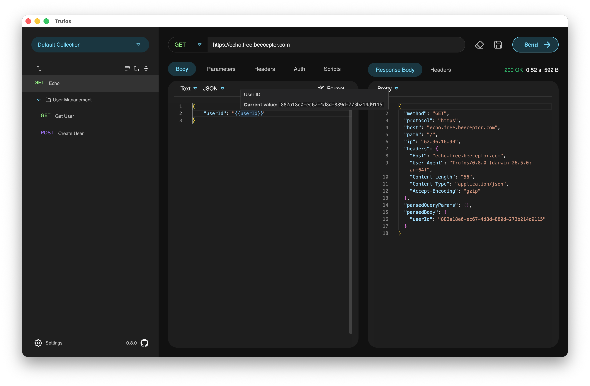

[](https://github.com/EXXETA/trufos/actions/workflows/ci.yml)

[](https://discord.gg/sb4nfdevpW)


<h1 align="center">Trufos — The REST Utility, Free and Open Source</h1>
<p align="center">
  A fast, offline-first REST client with no account required and no telemetry.
</p>





Trufos stores your collections as plain JSON files on disk, making them easy to version-control, diff, and share. It works fully offline — no registration, no cloud sync, no telemetry.

**Features:**

- Cross-platform — Windows, macOS, and Linux via Electron
- Offline-only — all data stays on your machine
- Version control-friendly — collections stored as JSON
- Import Postman collections
- Environment & variable management
- Authentication — Basic, JWT, OAuth 2.0 (client credentials)
- Pre/post request scripting
- Handles large payloads without blocking the UI

## Installation

Grab the latest release from the [GitHub Releases](https://github.com/EXXETA/trufos/releases) or the [Download](https://exxeta.github.io/trufos/download) page:

- **Windows:** `Setup.exe` installer
- **macOS:** `.dmg` image
- **Linux:** `.deb` installer or `.zip` archive

## Requirements

Trufos is an Electron application and runs on Windows, macOS, and Linux. To build or develop locally you need Node.js 24. This project uses **yarn** — do not use npm to install dependencies. If you're using yarn for the first time on your machine, run `corepack enable` before continuing. This project ships yarn with it, you don't need to install it manually on your machine.

### Local Development

```sh
git clone https://github.com/EXXETA/trufos
cd trufos
yarn install
yarn start
```

### Building

```sh
yarn install
yarn run make
```

The output lands in `out/make` — a `Setup.exe` on Windows, `.dmg` on macOS, and `.deb`/`.zip` on Linux.

### Development Commands

| Command               | Description                                       |
| --------------------- | ------------------------------------------------- |
| `yarn start`          | Run the app in development mode (Electron + Vite) |
| `yarn make`           | Package distributables for the current OS         |
| `yarn test`           | Execute Vitest test suite                         |
| `yarn lint`           | Run ESLint over TypeScript & React sources        |
| `yarn prettier`       | Format code (TS/TSX) with Prettier                |
| `yarn prettier-check` | Check formatting without writing changes          |

## Usage

### Importing Collections

Open the collection import view, select a Postman collection file or directory, and confirm. Trufos converts and saves it under a folder named after the collection title.

### Environments & Variables

Define named environments (e.g. `dev`, `staging`, `prod`) each with their own variables. Switching environments scopes variable resolution across all requests. Environments are stored as JSON alongside your collections.

## FAQ

**Where are my saved requests?**

- macOS: `~/Library/Application Support/Trufos/default-collection`
- Windows: `%AppData%\Trufos\default-collection`

**Where are the logs?**

- macOS: `~/Library/Logs/Trufos`
- Windows: `%AppData%\Trufos\logs`

## Contributing

Check out the [Contributing Guidelines](./CONTRIBUTING.md) and [Code of Conduct](./CODE_OF_CONDUCT.md) before you start. Feedback, suggestions, and pull requests are welcome.

## Licence

Licensed under GPL v3.0.
