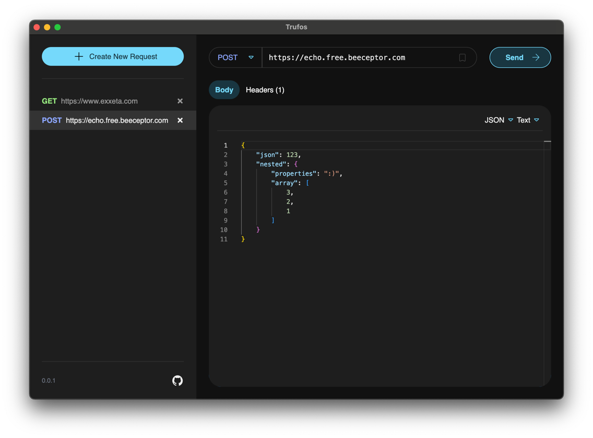

<h1 align="center">Trufos - The REST Utility, free and Open Source</h1>

  A REST client that is both easy to use, efficient, and extendable.

As many REST clients exist in the ecosystem, Trufos aims to provide an out-of-the-box experience
that is fast, user-friendly, and customizable. Trufos intends to offer the following features:

- Offline usage: No registration or login required
- Smooth handling of large request and response objects
- Version control-friendly storage of requests and collections, facilitating easy collaboration
- Custom handling of HTTP requests and responses via script injection
- Support for various authentication methods, including JWT, OAuth, and basic authentication
- Extendable plugin architecture for additional features and integrations

**Current Development Status**: Trufos is still at an early stage of development. Be aware of this
when using Trufos under production conditions. If you would like to contribute to this project,
please check out our [Contributing Guidelines](./CONTRIBUTING.md).

## Requirements

As Trufos is an Electron application, it can run on Windows, macOS, and Linux without any issues. If
you want to develop or build this software yourself, you will need Node.js version 22 or higher and
NPM version 10 or higher.

### Local Development

1. Clone this repository
2. Run `npm install` to install all dependencies
3. Run `npm start` to start the application in development mode

### Building the Application

1. Run `npm ci` to install all dependencies
2. Run `npm run make` to build the application for your platform
3. The built application will be in the `out/make` directory
    - Windows: a `Setup.exe` file
    - macOS: a `.dmg` file
    - Linux: currently a ZIP file (`.deb` file is planned)

## Usage

Once Trufos is installed and launched, you can start adding endpoints, customizing them, and making
calls.

### Example Usage

Here’s a simple example of how to add and utilize an endpoint:

1. Click on "Create New Request".
2. Enter the URL.
3. Select the method (`GET`, `POST`, etc.).
4. Optionally, add headers and body content.
5. Click "Send Request" and review the response in the results area.

## FAQ

* Where can I find the saved Requests?
* The saved requests are in this folder:
    * Mac: ``~/Library/Application\ Support/Trufos/default-collection``
    * Windows: ``C:\Users\USERNAME\AppData\Roaming\Trufos\default-collection``

## Contributing

If you would like to contribute to this project, please check out our
[Contributing Guidelines](./CONTRIBUTING.md) and [Code of Conduct](./CODE_OF_CONDUCT.md) before you
begin.

We welcome feedback, suggestions, and pull requests!

## Licence

Licensed under GPL v3.0.
