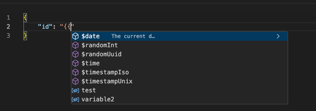
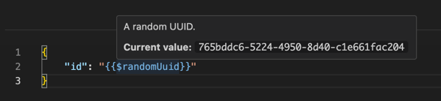



# Variables

Variables enable easy reuse of values in your requests. Any variable can be used in any request
using the syntax `{{ variableName }}`. Currently, there are three kinds of variables:

- **[System Variables](#system-variables)**: These are variables that are set by the system and
  cannot be changed by the user. Examples are the current time, or a random UUID.
- **[Collection Variables](#collection-variables)**: These are variables that are set at the
  collection level. They can be
  used in any request within the collection.
- **[Environment Variables](#environment-variables)**: These are variables that are set at the
  environment level. They can be
  used in any request within the collection and change based on the environment you are using (e.g.,
  development, staging, production).

When writing `{{` in your request, the editor will show you a list of all available variables. You
can navigate through the list using the arrow keys and select a variable by pressing `Enter`. The
variable will be inserted at the current cursor position.

A variables are highlighted in blue. When hovering over a variable, a tooltip will show you
the variable name, its current value, and optionally a description.

## System Variables

System variables are set by the system and cannot be changed by the user. They are globally
available and always active. System variables always start with a `$` sign and may contain dynamic
values. This means, that they may change their value each time they are used. The following system
variables are available:

| Variable Name    | Example Value                               | Description                                                                 |
|------------------|---------------------------------------------|-----------------------------------------------------------------------------|
| `$timestampIso`  | `2011-10-05T14:48:00.000Z`                  | The current timestamp in [ISO 8601](https://en.wikipedia.org/wiki/ISO_8601) |
| `$timestampUnix` | `1743946052`                                | The current timestamp in Unix Epoch                                         |
| `$time`          | `18:50:21 GMT-0500 (Central Daylight Time)` | The current time                                                            |
| `$date`          | `Tue May 12 2020`                           | The current date                                                            |
| `$randomInt`     | `1234567890`                                | A positive random integer less than 248                          |
| `$randomUuid`    | `0b32574b-38a9-4d09-843f-2a2b42bf428d`      | A random UUID v4                                                            |

## Collection Variables

Collection variables are set at the collection level. They can be used in any request within the
collection. Collection variables are defined in the collection settings.

## Environment Variables

Environment variables are set in an environment. They can be used in any request within the
collection and are active as long as the environment is selected.

